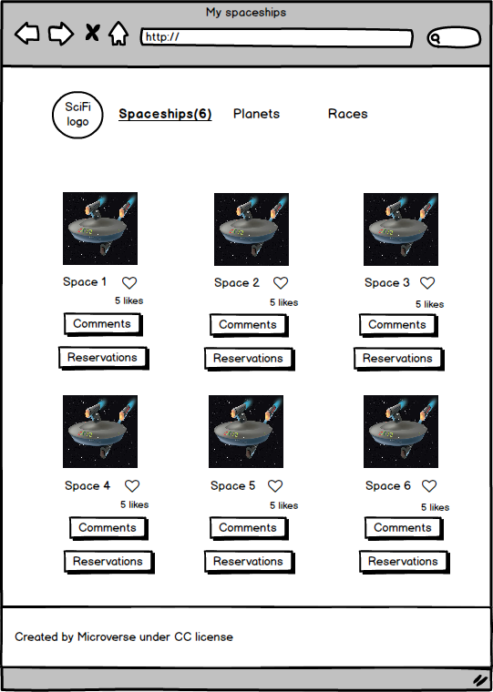
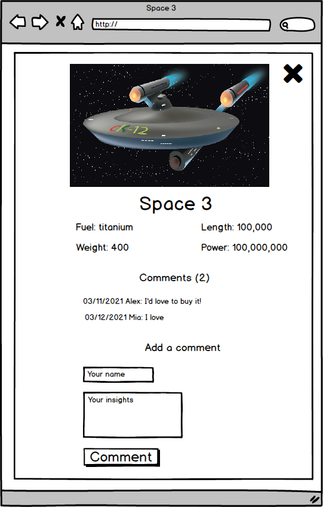
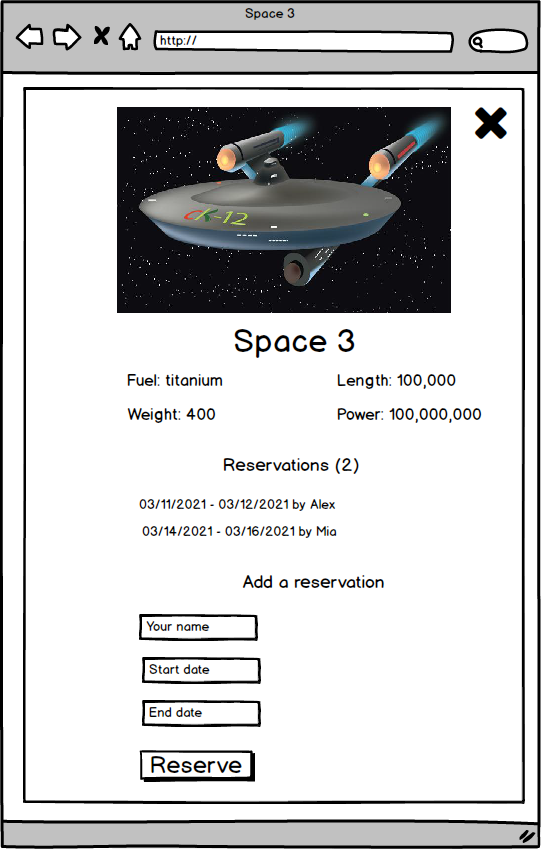

# GDSC Code Sprint 1.0  - Your API-based webapp

## Learning objectives

- Use JavaScript to make websites dynamic and build basic single page apps.
- Use ES6 syntax.
- Use ES6 modules.
- Use callbacks and promises.
- [Use webpack.](https://webpack.js.org/guides/getting-started/)
- Apply JavaScript best practices and language style guides in code.
- Use AAA pattern for unit tests.
- Write units tests for a JavaScript app.
- Follow Gitflow.
- Solve simple git conflicts.
- Send and receive data from an API.
- Use API documentation.
- Understand and use JSON.
- Make JavaScript code asynchronous.
- Perform a code review for a team member.

### Estimated time: 4.5h

## Description

The Code Sprint project ([remember what they are?](https://www.codecademy.com/resources/blog/what-is-a-sprint/)) is about building your own web application based on an external API. You will select an API that provides data about a topic that you like and then build the webapp around it. The webapp will have 2 or 3 user interfaces (depending on the size of your team):
- A home page showing a list of items that you can "like."
- A popup window with more data about an item that you can use to comment on it or reserve it for a period of time.

  

  

  

*IMPORTANT NOTE: Read **all** requirements before you start building your project.*

### General requirements

- Make sure that there are [no linter errors](./linters.md).
- Make sure that you used correct [Gitflow](./gitflow.md).
- Make sure that you documented your work [in a professional way](./professional-way.md).

### HTML/CSS & JavaScript requirements

- Follow our list of [best practices for HTML & CSS](./html-css-best-practice.md).
- Follow our list of [best practices for JavaScript](./javascript-best-practices.md).

### Project requirements

**IMPORTANT NOTE:** in this project you will also practice giving code reviews to your teammates. Remember to read the [Code Review](#code-review) carefully!

**APIs**
- First, you need to find an API so you can base the development of the webapp around it. The API should allow you to:
  - Get a list of items with a unique item id (or generate the unique id).
  - For a given item, get detailed information about it.
  
  We recommend that you choose an API that **doesn't need authentication**. if you select an API that requires authentication, you should implement it on your own. Also, if you select an API that provides **image** resources your webapp will be more visual.

  Some example APIs are:
  - [Pokeapi](https://pokeapi.co/): data about the Pokémon world.
  - [TVmaze API](https://www.tvmaze.com/api): data about TV series and movies.
  - [Meals DB](https://www.themealdb.com/api.php): data about meals.

You can find more APIs in [this GitHub repo](https://github.com/public-apis/public-apis) or in [ProgrammableWeb](https://www.programmableweb.com/category/all/apis). Some of the APIs require a token, some require authentication, and some others are just open.
- You will use our [Involvement API](https://www.notion.so/microverse/Involvement-API-869e60b5ad104603aa6db59e08150270) to record the different user interactions (likes, comments and reservations).

**Interfaces**
- You should build these interfaces:
  - The *home page*.
  - The *comments popup*.
  - The *reservations popup* (only for the groups of 3 students).
- You should follow the layout of the wireframes provided. You should personalize the rest of the design including colors, typographies, spacings, etc.
- Home page
  - When the page loads, the webapp retrieves data from:
    - The selected API and shows the list of items on screen.
    - The Involvement API to show the item likes.
  - Remember that your page should make only 2 requests:
    - One to the base API.
    - And **one** to the Involvement API.
  - When the user clicks on the Like button of an item, the interaction is recorded in the Involvement API and the screen is updated.
  - When the user clicks on the "Comments" button, the Comments popup appears.
  - When the user clicks on the "Reservations" button, the Reservations popup appears (only for the groups of 3 students).
  - Home page header and navigation similar to the given mockup.
  - Home page footer similar to the given mockup.
- Comments popup
  - When the popup loads, the webapp retrieves data from:
    - The selected API and shows details about the selected item.
    - The Involvement API to show the item comments.
  - When the user clicks on the "Comment" button, the data is recorded in the Involvement API and the screen is updated.
- Reservations popup (only for the groups of 3 students)
  - When the popup loads, the webapp retrieves data from:
    - The selected API and shows details about the selected item.
    - The Involvement API to show the item reservations.
  - When the user clicks on the "Reserve" button, the data is recorded in the Involvement API and the screen is updated.

**Counters**
We have counters in all the interfaces that show:
- The number of items (home).
- The number of comments (comments popup).
- The number of reservations (reservations popup) - only for the groups of 3 students.

Even if the API gives you these numbers, you will create a specific function to calculate these numbers in each page. These count functions need to be covered with unit tests using Jest.

**Technical set up**
- Set up the repository on GitHub and use Gitflow.
- Set up webpack.
- Set up a JavaScript testing library (Jest).

### Project documentation

Once you have finished the development of the project, you should record a video presenting the features of the project you built. It is a video with a **maximum length of 5 minutes**. The content of the video should include:

- A description of the project.
- A demo of the project features.
- You should also highlight some interesting piece of code or something you built that you are very proud of.
- You all should appear in the video and talk about the project.

For recording the video you can use the Zoom recording features while in a call with your peers.

### Workload distribution

In order to tackle this challenge, we created [a template of the Kanban board with GitHub project]('./kanbanboard.md') that translates the requirements into a set of tasks that you will be able to use to organize your work. You will create your own copy of that board in the separate activity.

You will be working in this way:
- The common tasks (set up repo, find the API, shared work on the home page) will be divided among all of you or completed as a team (pair programming).
- The tasks related to a specific page will be developed individually, with every student owning the development of one page.
- All tasks should be based on the cards from your Kanban board.

Below you can see a suggestion of what you can do every day (just a suggestion, not mandatory).

### Hour 1

- Choose the topic for your website and the API.
- Choose images, text, icons, fonts.
- Set up the repository and tools.

### Hour 2

- Create the basic shared code on the home page.
- Start individual interfaces.
- Give code reviews to your teammates.

### Hour 3

- Work on individual interfaces.
- Give code reviews to your teammates.

### Hour 4

- Complete the work on individual interfaces.
- Record a video for your project.
- Create a good README and PR description.
- Ask for the external review - using your Student Dashboard.

## Work and submission mode

- You should implement the above requirements only in **one repository** in your group.
- You should ask for a review and submit this activity **on behalf of your group.**

## Code review

You will give and receive code reviewes from your teammates. Each task (i.e. each card) should have a separate pull request that is reviewed by one of your teammates. Be nice to your teammates and add link to the PR in specific card's comments.
Once the entire project is ready, one of your team members will request a code review on behalf of your group.

## Submit your project
We have provided a from here to submit your project. You will need to submit group name, group leader, the link to your repository and the link to your video presentation. [Here](https://forms.gle/T3DWj9a1R89J1oU89)

## Additional requirements

*These are all optional, but if you're interested in exploring this topic further, feel free to implement them. Any exploration here should be done outside program time.*

*If you decide to implement these requirements you should do it in a separate pull request. As always, remember to clearly document your decision in GitHub comments.*

- You could implement some UX improvements: include transitions and/or animations, etc.
- You can implement additional home pages, one page per category of items.
- Make sure that you have a decent mobile design for the webapp.

**Remember to add cards to your Kanban board if you decide to implement additional tasks.**

------
